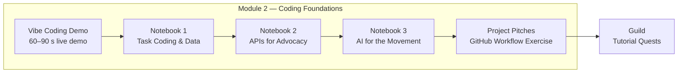

<!--
  tech_stack: Python 3, Google Colab, OpenRouter, OpenFoodFacts API, Our World in Data, GitHub
  project_status: active-development
  difficulty: beginner-intermediate
  skill_tags: python, jupyter, llm-apis, rest-apis, data-visualisation, git-workflow
  related_repos: platform, structured-coding-with-ai
-->

# C4C Bootcamp

[](https://github.com/Open-Paws/c4c-bootcamp)
[](LICENSE)
[](https://openpaws.ai)
[](https://github.com/Open-Paws/no-animal-violence)
[](https://colab.research.google.com)

---

**Code for Compassion Campus bootcamp materials** — teaching notebooks, exercises, and demo scripts for training developers to build AI tools for animal liberation, climate action, and AI safety. Students work with real movement APIs and real advocacy data from day one — no toy examples, no generic starter apps.

The bootcamp is the entry point of the Layer 1 developer pipeline: **Bootcamp → Hackathon → Guild → Resident Developer Programme (RDP)**. The May 2026 cohort runs in Bengaluru and Mumbai.

> [!NOTE]
> This project is part of the [Open Paws](https://openpaws.ai) ecosystem — AI infrastructure for the animal liberation movement. [Explore the full platform →](https://github.com/Open-Paws)

---

## Curriculum Map



| Module | Status | Description |
|--------|--------|-------------|
| **Module 2 — Coding Foundations** | Shipped | Data exploration, REST APIs, LLM calls, GitHub workflow |

---

## Quickstart

Students need a GitHub account, a Google account (for Colab), and an OpenRouter account (free tier) for Notebook 3. No local Python installation required.

**1. Open Notebook 1 in Colab:**
```
https://colab.research.google.com/github/Open-Paws/c4c-bootcamp/blob/main/module-2/notebooks/module-2-1-task-coding-demo.ipynb
```

**2. Open Notebook 2 in Colab:**
```
https://colab.research.google.com/github/Open-Paws/c4c-bootcamp/blob/main/module-2/notebooks/module-2-2-api-exercise.ipynb
```

**3. Open Notebook 3 in Colab — add your OpenRouter API key first:**

In Colab, open the Secrets panel (key icon, left sidebar), add `OPENROUTER_API_KEY`, then open:
```
https://colab.research.google.com/github/Open-Paws/c4c-bootcamp/blob/main/module-2/notebooks/module-2-3-openrouter-ai-for-advocacy.ipynb
```

**4. Complete the Project Pitches exercise** — fork the pitches directory, write a pitch, open a PR, review a classmate's.

**5. For local development (instructors):**
```bash
git clone https://github.com/Open-Paws/c4c-bootcamp.git
cd c4c-bootcamp
pip install jupyter matplotlib requests
jupyter notebook
```

---

## Features / Modules

### Module 2 — Coding Foundations

The first hands-on coding module. Students go from zero to making real API calls and LLM requests using advocacy data.

| Notebook | What It Teaches | Data / APIs Used |
|----------|----------------|-----------------|
| [`module-2-1-task-coding-demo.ipynb`](module-2/notebooks/module-2-1-task-coding-demo.ipynb) | Cell-by-cell execution, CSV parsing, matplotlib charting | FAO animals-slaughtered data via Our World in Data |
| [`module-2-2-api-exercise.ipynb`](module-2/notebooks/module-2-2-api-exercise.ipynb) | HTTP GET/POST, JSON parsing, REST APIs | OpenFoodFacts (vegan product checker), JSONPlaceholder, FAO/IPCC environmental data |
| [`module-2-3-openrouter-ai-for-advocacy.ipynb`](module-2/notebooks/module-2-3-openrouter-ai-for-advocacy.ipynb) | LLM API calls, token economics, model routing, system prompts | OpenRouter (GPT-4o-mini, Claude Haiku, Claude Sonnet) |

**Supporting materials:**

| Directory | Contents |
|-----------|----------|
| [`module-2/project-pitches/`](module-2/project-pitches/) | Standalone GitHub workflow exercise — students fork, branch, commit, and open a PR to submit a project idea |
| [`module-2/vibe-coding-demo/`](module-2/vibe-coding-demo/) | Prompt examples for a 60–90 second live or recorded AI code-generation demo |

Each notebook takes approximately 45–90 minutes. The project pitches exercise takes approximately 60 minutes with instructor support.

---

## Documentation

- [`CLAUDE.md`](CLAUDE.md) — authoritative agent context, architecture decisions, India-specific framing notes
- [`module-2/CLAUDE.md`](module-2/CLAUDE.md) — Module 2 learning arc, subdirectory index, API reference table
- [`module-2/project-pitches/README.md`](module-2/project-pitches/README.md) — student-facing GitHub exercise instructions
- [`module-2/project-pitches/CONTRIBUTING.md`](module-2/project-pitches/CONTRIBUTING.md) — fork/branch/PR workflow guide

---

<details>
<summary><strong>Architecture</strong></summary>

```
c4c-bootcamp/
├── module-2/                          # Coding Foundations module
│   ├── notebooks/
│   │   ├── module-2-1-task-coding-demo.ipynb      # Data exploration, matplotlib, FAO data
│   │   ├── module-2-2-api-exercise.ipynb          # HTTP, JSON, REST APIs, OpenFoodFacts
│   │   └── module-2-3-openrouter-ai-for-advocacy.ipynb  # LLM APIs, tokens, cost, prompts
│   ├── project-pitches/               # Fork-branch-PR exercise (publishable as separate repo)
│   │   ├── pitches/                   # Student pitch submissions
│   │   ├── README.md
│   │   ├── CONTRIBUTING.md
│   │   └── .github/PULL_REQUEST_TEMPLATE.md
│   └── vibe-coding-demo/
│       └── demo-script.md             # 60–90 s screen-recording demo script
├── CLAUDE.md                          # Authoritative agent context
├── AGENTS.md
└── .github/workflows/
    ├── auto-merge.yml
    └── no-animal-violence.yml         # Speciesist language check on all PRs
```

**Tech stack:**

| Technology | Role |
|------------|------|
| Python 3 | Notebook language |
| Google Colab | Execution environment (no local install required) |
| OpenRouter | LLM API gateway (GPT-4o-mini, Claude Haiku, Claude Sonnet) |
| OpenFoodFacts API | Vegan product data |
| Our World in Data | FAO animal agriculture statistics |
| GitHub | Version control exercise platform |

**Pipeline context:** Bootcamp is Layer 1 of the developer pipeline. Graduates feed directly into the Guild — a paid marketplace for advocacy technology quests. Five tutorial quests serve as the post-bootcamp on-ramp (see `programs/developer-training-pipeline/guild/tutorial-quests.md` in the strategy repo).

</details>

---

## Contributing

### Adding a Notebook

1. Place the notebook in `module-N/notebooks/` where N is the module number.
2. Ensure it runs completely on Colab free tier with no local dependencies.
3. Load API keys via `google.colab.userdata.get(...)` — never hardcoded.
4. Use domain-correct terminology: **farmed animal** (not "livestock"), **factory farm** (not "farm"), **slaughterhouse** (not "processing facility").
5. Update `module-N/notebooks/CLAUDE.md` with a summary row for the new notebook.

### Adding a Module

Create `module-N/` following the structure of `module-2/`. Include a `CLAUDE.md` in the module root and in each subdirectory.

### Adding a Project Pitch

See [`module-2/project-pitches/README.md`](module-2/project-pitches/README.md) and [`module-2/project-pitches/CONTRIBUTING.md`](module-2/project-pitches/CONTRIBUTING.md).

### Code Quality

All pull requests are checked for speciesist language via the `no-animal-violence` GitHub Action. Run locally:

```bash
semgrep --config semgrep-no-animal-violence.yaml
```

---

## Impact / Adoption

The May 2026 cohort is the first live delivery — Bengaluru and Mumbai. Adoption numbers will be reported here after the cohort completes.

<!-- TODO: add cohort size, graduate count, and Guild conversion rate after May 2026 launch -->

---

## License and Acknowledgments

[MIT License](LICENSE) — Copyright (c) 2026 Code for Compassion Campus.

Built by [Open Paws](https://openpaws.ai) for the animal liberation movement. Teaching materials use public datasets from [Our World in Data](https://ourworldindata.org) and the [OpenFoodFacts](https://world.openfoodfacts.org) open database.

---

[Donate](https://openpaws.ai/donate) · [Discord](https://discord.gg/openpaws) · [openpaws.ai](https://openpaws.ai) · [Volunteer](https://openpaws.ai/volunteer)
